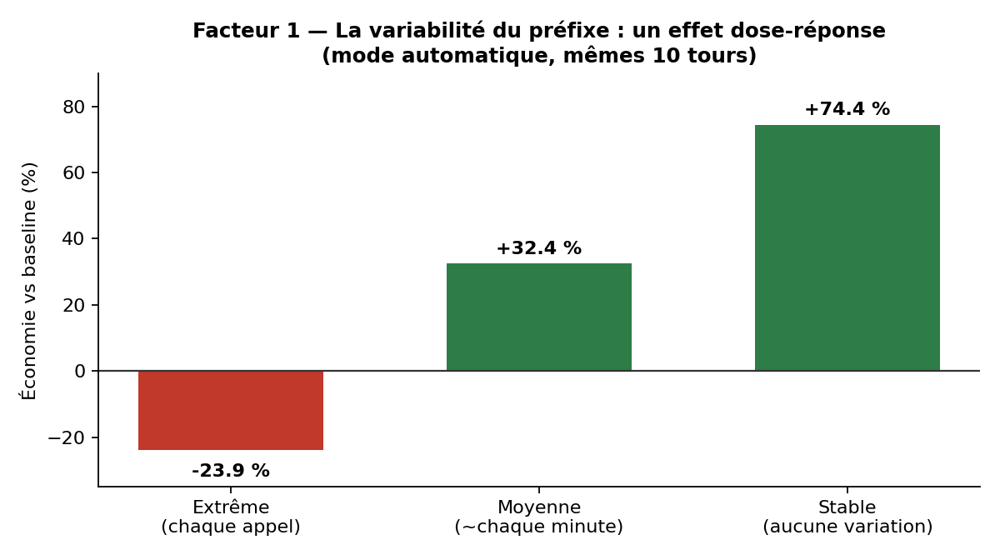
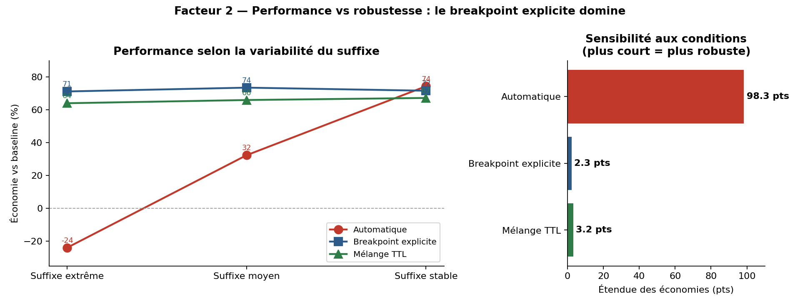
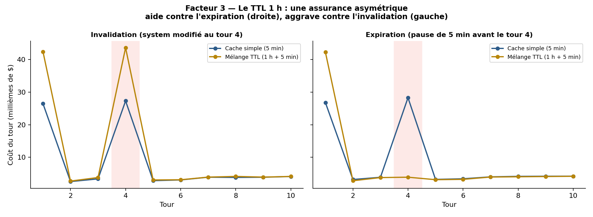
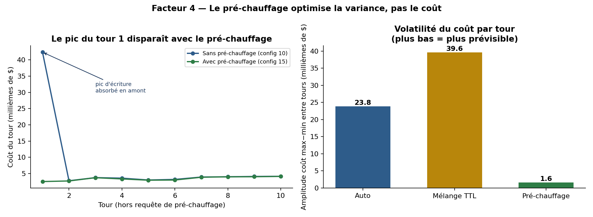

# Prompt caching : performance, robustesse et coûts

**Étude expérimentale de 8 stratégies de mise en cache sur l'API Claude (Haiku 4.5)**

*Corpus : Constitution française du 4 octobre 1958 (~20 800 tokens). 10 tours de conversation par configuration. Coûts calculés depuis le champ `usage` des réponses. Tarifs relevés le 24/07/2026.*

---

## Résumé exécutif

Trois résultats mesurés, contre-intuitifs, qui contredisent l'idée reçue « activer le cache réduit les coûts » :

1. **Le cache mal configuré coûte plus cher que pas de cache du tout.** Un suffixe qui change à chaque requête fait chuter l'économie à **−23,9 %** (config 03) : on paie l'écriture sans jamais lire.
2. **La performance de pointe n'est pas la robustesse.** Le mode automatique atteint la meilleure économie (74,4 %) mais varie de **98,3 points** selon les conditions. Le breakpoint explicite sacrifie ~1 point de performance pour une variation de **2,3 points seulement** — une sensibilité divisée par 40.
3. **Le pré-chauffage n'optimise pas le coût, mais la variance.** À économie égale (~67 %), il réduit la volatilité du coût par tour d'un **facteur 25**.

**Recommandation par défaut :** pour un système en production réel, le breakpoint explicite est le choix le plus sûr — performance quasi maximale et insensibilité aux conditions d'exploitation.

---

## 1. Protocole

| Paramètre | Valeur |
|---|---|
| Modèle | `claude-haiku-4-5` |
| Corpus | Constitution française 1958, ~20 800 tokens (source publique, reproductible) |
| Seuil de cacheabilité | 4 096 tokens |
| Charge | 10 questions identiques pour toutes les configurations |
| Mesure | champ `usage` de chaque réponse (aucune estimation) |
| Référence | config 01, sans `cache_control` |

**Deux garanties de rigueur expérimentale :**

- **`RUN_ID` unique par exécution** — un identifiant régénéré à chaque lancement garantit un cache neuf, sans contamination entre deux scripts ni attente d'expiration. Chaque configuration part de zéro.
- **Corpus public** — la Constitution est reproductible par un tiers, contrairement à un document interne.

**Tarifs appliqués** ($/million de tokens, Haiku 4.5) :

| Catégorie | Prix | Multiplicateur |
|---|---|---|
| Entrée non cachée | 1,00 | ×1 |
| Lecture de cache | 0,10 | ×0,1 |
| Écriture cache 5 min | 1,25 | ×1,25 |
| Écriture cache 1 h | 2,00 | ×2 |
| Sortie | 5,00 | — |

---

## 2. Facteur 1 — La variabilité du préfixe : un effet dose-réponse



Le piège du suffixe variable n'est pas un interrupteur mais un **gradient**. En mode automatique, à mesure que le suffixe (placé après le contenu stable) change plus souvent, l'économie s'effondre proportionnellement :

| Fréquence de changement du suffixe | Économie | Réécritures complètes |
|---|---|---|
| Stable (aucune) | **+74,4 %** | 1 / 10 tours |
| Moyenne (~1×/minute) | +32,4 % | ~5 / 10 tours |
| Extrême (chaque appel) | **−23,9 %** | 10 / 10 tours |

**Mécanisme.** Le mode automatique place son point de rupture sur le dernier bloc — ici le bloc variable. Le hachage du préfixe change alors à chaque requête, aucune correspondance n'est trouvée, et tout l'input est facturé au tarif d'écriture (×1,25) sans jamais déclencher de lecture (×0,1). Le surcoût de ~24 % correspond exactement à ce multiplicateur.

**Le point contre-intuitif :** le contenu stable est bien présent, identique, juste avant le point de rupture. Mais les écritures ne se produisent qu'**au** point de rupture : aucune requête n'écrit jamais d'entrée à la position « fin du contenu stable », donc la recherche arrière ne trouve rien. Le système ne cherche pas du contenu stable, il cherche des écritures antérieures.

---

## 3. Facteur 2 — Performance vs robustesse



En croisant les 3 stratégies avec les 3 niveaux de variabilité (plan factoriel complet 3×3), la métrique importante n'est plus la performance mais **l'étendue** — l'écart entre le meilleur et le pire cas.

| Stratégie | extrême | moyen | stable | **étendue** |
|---|---|---|---|---|
| Automatique | −23,9 % | +32,4 % | +74,4 % | **98,3 pts** |
| Breakpoint explicite | +71,2 % | +73,6 % | +71,7 % | **2,3 pts** |
| Mélange TTL | +64,1 % | +66,0 % | +67,3 % | **3,2 pts** |

**Lecture.** Le mode automatique est le plus performant *dans le meilleur cas*, mais son résultat dépend entièrement des conditions d'exploitation — imprévisible en production. Le breakpoint explicite atteint quasiment la même performance (73,6 % au mieux) tout en étant **insensible** à la variabilité : sa performance ne suit même pas une tendance monotone (71,2 → 73,6 → 71,7), le bruit domine le signal, ce qui est la signature d'une stratégie robuste.

**C'est un arbitrage d'ingénierie classique :** performance nominale contre sensibilité aux conditions réelles. En production, où l'on ne contrôle pas toujours la variabilité du préfixe, la robustesse prime.

---

## 4. Facteur 3 — Le TTL 1 h, une assurance asymétrique



Le cache 1 heure (mélange TTL) protège le contenu stable des silences prolongés. Mais son effet dépend du type de perturbation, et il peut se retourner :

| Perturbation au tour 4 | Cache simple (5 min) | Mélange TTL (1 h) | Écart |
|---|---|---|---|
| Expiration (pause > 5 min) | 62,8 % | 67,1 % | **+4,3 pts** ✓ |
| Invalidation (system modifié) | 64,6 % | 49,9 % | **−14,6 pts** ✗ |

**Contre l'expiration, l'assurance joue** (graphique de droite) : le document en cache 1 h survit au silence, le pic de réécriture au tour 4 disparaît.

**Contre l'invalidation, l'assurance aggrave** (graphique de gauche) : modifier le system prompt force la réécriture du document — et cette réécriture se paie désormais au tarif 1 h (×2) au lieu du tarif 5 min (×1,25). On observe des pics de coût doublés au tour 4.

**Règle pratique :** le TTL 1 h est bénéfique si le risque dominant est le silence entre requêtes, néfaste si le contenu caché est susceptible d'être modifié en cours de session.

---

## 5. Facteur 4 — Le pré-chauffage optimise la variance, pas le coût



Le pré-chauffage (`max_tokens=1` avant le premier utilisateur) a une économie totale identique à sa configuration équivalente sans pré-chauffage (~67 %) : sur le coût pur, **l'effet est dans le bruit et non concluant** avec un seul run.

En revanche, son effet sur la **volatilité** est massif et sans ambiguïté :

| Configuration | Amplitude du coût par tour (max−min) |
|---|---|
| Automatique (02) | 23,9 millièmes de $ |
| Mélange TTL (10) | 39,6 millièmes de $ |
| **Pré-chauffage (15)** | **1,6 millième de $** (÷25) |

**Ce que le pré-chauffage achète réellement :** en absorbant l'écriture initiale *avant* l'arrivée de l'utilisateur, il supprime le pic du premier tour. Le coût par requête devient quasi constant. C'est un argument FinOps distinct — facturation lissée et prévisible, absence de pic de latence sur le premier utilisateur (TTFT) — et non un gain de coût.

> Note comptable : la requête de pré-chauffage (tour 0) est comptée dans le total de la config 15. L'exclure fausserait le bilan.

---

## 6. Matrice de décision

| Votre situation | Stratégie recommandée | Gain observé |
|---|---|---|
| Préfixe stable, contrôle total du prompt | Automatique | 74,4 % |
| Contenu variable en fin de prompt (horodatage, contexte par requête) | **Breakpoint explicite** | ~72 %, insensible |
| Silences fréquents > 5 min entre requêtes | Mélange TTL | +4 pts vs cache simple |
| Instructions modifiées en cours de session | **Éviter le TTL 1 h** OU  modifier l'instruction à travers le **system User** | −14,6 pts sinon |
| Latence du 1er appel / facturation à lisser | Pré-chauffage | volatilité ÷25 |
| Préfixe < 4 096 tokens | **Pas de cache** | aucun effet, échec silencieux |

---

## 7. Limites de l'étude

- **n = 1 par configuration.** Aucune moyenne ni écart-type. Les écarts inférieurs à ~3 points (ex. pré-chauffage vs équivalent sur le coût) ne sont pas concluants ; seuls les effets massifs (dose-réponse, robustesse, asymétrie, volatilité) le sont.
- **Un seul modèle** (Haiku 4.5) et un seul palier de seuil (4 096 tokens). Les modèles à seuil de 1 024 tokens rendent le cache rentable sur des préfixes plus courts.
- **Coûts calculés, non facturés** : tokens rapportés par l'API × tarifs publics, pas une facture réelle.
- **Tarifs datés du 24/07/2026** — à revérifier avant toute décision budgétaire.

---

## 8. Prérequis

**Environnement :**

- Python ≥ 3.9
- Un compte Anthropic avec une clé API valide, exposée dans la variable d'environnement `ANTHROPIC_API_KEY`
- Accès au modèle `claude-haiku-4-5`

**Dépendances Python** (voir `requirements.txt`) :

| Paquet | Rôle |
|---|---|
| `anthropic` | client de l'API Claude (exécution des expériences) |
| `pandas` | chargement et agrégation des mesures |
| `matplotlib` | génération des figures |

```bash
pip install anthropic pandas matplotlib
```

**Budget et durée :**

- **Coût** : l'ensemble des 15 configurations consomme environ **1,5 à 2 $** de crédits API (chaque run traite ~20 800 tokens de préfixe sur 10 tours). L'analyse seule (`analyse.py`, à partir des CSV fournis) est **gratuite** — elle n'appelle pas l'API.
- **Durée** : deux configurations incluent une pause délibérée de 5 min 30 (tests d'expiration du TTL, configs 13 et 14). Prévoir ce délai si vous relancez ces scripts.

**Reproductibilité :**

- Le corpus (`constitution.txt`) est fourni : aucune donnée externe à télécharger.
- Le `RUN_ID` unique garantit un cache neuf à chaque exécution — les scripts peuvent être lancés dans n'importe quel ordre, sans attente entre eux.
- Les CSV de mesures étant inclus, **régénérer les figures ne nécessite ni clé API ni budget**.

---

## 9. Reproduire

```bash
pip install -r requirements.txt
python analyse.py          # régénère les figures et robustesse.csv
```

- Mesures brutes tour par tour : [`results/measures.csv`](results/measures.csv)
- Agrégats et économies : [`results/summary.csv`](results/summary.csv)
- Métrique de robustesse dérivée : [`results/robustesse.csv`](results/robustesse.csv)
- Détail des scripts d'expérimentation : [`results/scripts_readme.md`](results/scripts_readme.md)

---

## Licence

MIT